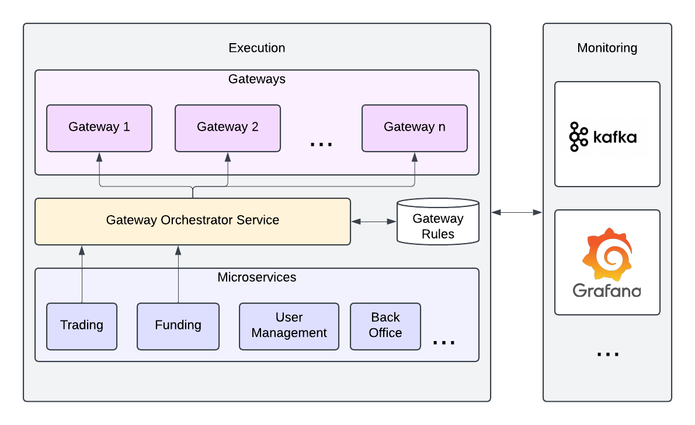
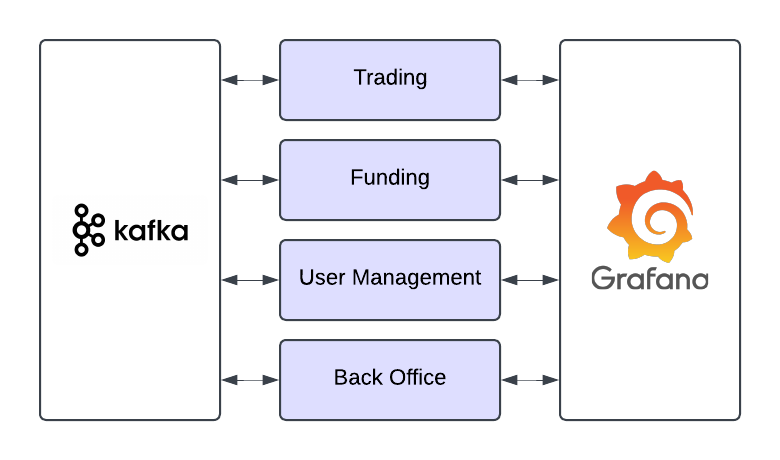

# Exinity Architecture Assignment

The task here is to design something at a high level which facilitates payments in/out of a trading platform. In keeping with the task it often helps to visualise what the potential requirements of the system are and how they should be classified in terms of criticality. In a real life scenario this would be done with stakeholder input, however, given that this is an assessment I will take some liberties in my classifications which in turn will drive a list of requirements we can feed into our design. For this I will use the `MoSCoW` analysis [https://en.wikipedia.org/wiki/MoSCoW_method](see here), to scope things out.

## MoSCoW Analysis

### Must Have

- The gateways must be able to be picked dynamically. The primary driver for this will be region, however, there are potentially multiple other criteria too, such as weighting and network load.
- Gateways should be independent from one another. It should be reasonably simple to add or remove gateways into the system.
- Gateways are not infallible, if they fail then this should be detected and logged, additionally any payments/transactions should be directed to another gateway to ensure they are processed.

### Should Have

- Load balancing across gateways where there are multiple to choose from.
- Ability to detect a failing gateway so that it is no longer selected.
- Verbose an detailed logging and monitoring, so that issues can be identified quickly.

### Could Have

- Real time monitoring dashboards.
- Predictive failover mechanisms (use predictive analytics to detect potential gateway failures based on historical data and redirect traffic preemptively).
- An SMS/Email notification system when a service goes down.

## Design

From the above we can see that the number of components in this system has the potential to grow quite large. We'll need to handle communication well between systems and monitor each of them independently, I recommend using a message/event broker to handle this as all communication is then streamlined through one place. 

Services could be spun up/shut off independently too, and so failovers need to be implemented, for this a `Gateway Orchestrator` could be used, a microservice itself, it's responsibilities would be to control the gateways, select them, and ensure successful completion, state of transactions would be handled via `Kafka`

### Gateway Selection

From my initial thoughts, there are mainly 2 ways this could be handled. Either in a custom software component, or using a dedicated service such as `nginx` or `envoy` which are reverse proxies and can route your request. The 3rd party services are low-latency, well tested, secure and widely used as reverse proxies worldwide, however, there is a certain lack of flexibility and difficulty in setting up rules with them, the more complex your criteria, the harder they will be to maintain.

If you take a software approach you can have as many rules as you like to to accomplish the same thing. It's ultimately a question of preference taking into account reliability and flexibility.

In either case though the high level view doesn't change too much. You have a component in the middle that is responsible for 2 things.

- Selecting an appropriate gateway to forward the request to.
- Ensuring the request is successfully processed.

A gateway would take a request from the gateway orchestrator and if after a defined time (say a context timeout) it doesn't post an event to `Kafka`, then it will select the next available gateway and continue.

As it handles local state directly if a gateway consistently failed, then it would log a `critical` level event to `Kafka` and stop using this gateway. It could also have functionality such as `burst rate limiting` whereby it will choose another gateway if too many requests are sent or cache them so that excess requests aren't fired too quickly to one another.

Transactions for simplicity could have 3 states. `PENDING`, `SUCCESS` or `FAILURE`. The `Gateway Orchestrator` would subscribe to events on `Kafka` and update it accordingly. If a `Gateway` failed then the orchestrator would flag that `Gateway` as unavailable. This could either be through keeping track of failed transactions or reading `Kafka` events.

### Intra Component Communication

There is a need for each of the components to communicate with each other, in sending requests to one another and also in relaying state. There a many ways to accomplish this. In my approach I have opted to integrate each services with `Kafka` for communication and `Grafana` for monitoring. Below are some alternatives with pros and cons.

Service | Pros | Cons
--- | --- | ---
Pure message brokering e.g. `RabbitMQ` | General purpose message broker, ensures delivery of messages | Not as low latency as alternatives, sub-optimal for logging
`Kafka`| A distributed event streaming platform, optimised for low-latency, can be distributed, optimised for event-driven architectures | Steep initial learning curve, can be hard to set up `topics` initially so your data is well organised
Direct API communication (not recommended) | Each service has its own communication channels | Messages are no longer service agnostic and so must be aware of each other so they can communicate, logging and monitoring gets hard to manage as the responsibility for logging falls on each microservices.

### Data Stores

Generally speaking, I'm a big fan of data segregation, I think that in a microservices based approach to building larger systems, that each sub-system should only have access to the data that it needs. For instance a service that handles user authentication and verification doesn't need to know about the prices of assets. Similarly the trading engine doesn't need to know about sensitive user information.

I think if you want to follow the true ideals of microservice based architecture, then each microservice should have its own database which contains the data it needs. In cases for instance where data does need to be shared it can be safely duplicated. In this example if a user changed location then this would send an event to Kafka. This would then be processed by any microservice that may require this information where they can update their own data stores accordingly.

### Further Notes

With `golang` establishing itself as the best language out there for building microservices, the way you can verify your system `robustness` primarily would be to see if microservices can operate truly independently from others. In my opinion this makes any system not only robust but also incredibly maintainable and flexible as components can be worked on independently and roll outs of new features can be component centric.

## Diagram

The first diagram is a layered architecture which is `Gateway Orchestrator Service` centric. For simplicity it shows the trading and funding microservices interfacing with it directly. In reality (as seen in diagram 2) all services communicate with `Grafana` and `Kafka`.

`Kakfa` acts as an event delivery system while also handling logs and state.

Another thing that could be added here (but isn't in the diagram) would be some sort of load balancer to a second (backup) orchestrator. Where one can be updated while the other one stays up. This could be as simple as putting a `nginx` reverse proxy in front of it.

In the second diagram we can see each service independently operating with `Kafka`. So here if back office wanted to update the rules they could use their back office service which would publish to `Kafka` with that event being consumed by the gateway orchestrator and the rules being updated accordingly.

It is a matter of design and mostly preference whether you want the gateway orchestrator to be responsible for both selecting a gateway and also ensuring successful transactions. This could also be a separate microservice that listens for failures and submits new requests.

## Final Notes

In the code base it is set up with each service as a sub package of the `services` package, this is just for demonstration purposes. Ideally my preference is to have multiple smaller isolated repositories.

The deployment environment for this, if it truly is a pure microservice, shouldn't matter. It could be deployed as a whole on `Kubernetes` or with each "component" in separate locations. The idea is for each component to exist withing its own eco-system and to consume/provide events to `Kafka` which in turn can be consumed by other events.

This initial overhead of working and integrating with `Kafka` can be costly, but it allows the solution to scale horizontally very easily.
